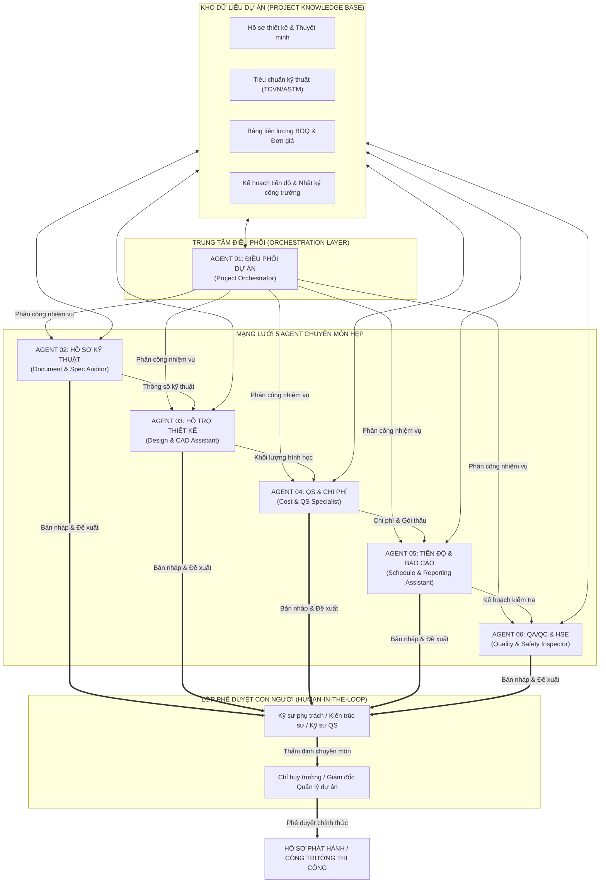

# BẢN MÔ TẢ KIẾN TRÚC HỆ THỐNG 6 AI AGENT DỰ ÁN XÂY DỰNG
### Khung điều phối đa tác nhân (Multi-Agent System) và Cơ chế Human-in-the-loop (HITL)
**Đơn vị phát triển:** CES Global ([https://aec.cesglobal.com.vn/](https://aec.cesglobal.com.vn/))

---

## 1. TỔNG QUAN KIẾN TRÚC HỆ THỐNG (SYSTEM OVERVIEW)

Trong một dự án xây dựng điển hình, thông tin luân chuyển liên tục qua nhiều mắt xích: từ Hồ sơ mời thầu, Bản vẽ thiết kế kỹ thuật, Dự toán khối lượng BOQ, Kế hoạch tiến độ thi công, đến Giám sát nghiệm thu hiện trường. Sự đứt gãy thông tin giữa các khâu là nguyên nhân cốt lõi gây ra sai lệch khối lượng, chậm tiến độ và đội vốn đầu tư.

Mô hình **Hệ thống 6 AI Agent Xây Dựng** được tổ chức theo cấu trúc mạng lưới tập trung có điều phối (Orchestrated Multi-Agent Architecture). Tất cả các Agent đều sử dụng chung một **Kho tri thức dự án chuẩn hóa (Project Knowledge Base)**, trao đổi dữ liệu qua giao thức bàn giao (Handoff Protocol) và chịu sự kiểm duyệt bắt buộc của Kỹ sư chuyên môn.



---

## 2. ĐẶC TẢ CHI TIẾT TỪNG AI AGENT TRONG HỆ THỐNG

### 2.1. Agent 01: Điều Phối Dự Án (Project Orchestrator)
- **Định danh nghiệp vụ:** Tổng điều phối viên thông tin kỹ thuật dự án.
- **Vai trò cốt lõi:**
  - Nắm giữ toàn bộ **Hồ sơ bối cảnh dự án (Project Context Profile)**: Tên công trình, cấp công trình, địa điểm, chủ đầu tư, tư vấn thiết kế, nhà thầu chính, các mốc tiến độ chính (Milestones).
  - Tiếp nhận yêu cầu từ người dùng, phân tích phạm vi công việc và chuyển giao (routing/handoff) cho Agent chuyên môn phù hợp.
  - Tổng hợp báo cáo đa cấu phần từ các Agent con trước khi gửi kỹ sư phê duyệt.
- **Nguồn dữ liệu truy cập:** Context Profile, Danh mục tài liệu dự án, Sơ đồ tổ chức nhân sự dự án.
- **Ràng buộc an toàn:** Không tự ý đưa ra kết luận kỹ thuật chuyên sâu (như tính kết cấu hay đơn giá BOQ) mà phải ủy quyền cho Agent chuyên trách.

### 2.2. Agent 02: Hồ Sơ Kỹ Thuật (Document & Spec Auditor)
- **Định danh nghiệp vụ:** Chuyên gia rà soát hồ sơ mời thầu, chỉ dẫn kỹ thuật và tiêu chuẩn xây dựng.
- **Vai trò cốt lõi:**
  - Tiếp nhận và giải mã các tệp hồ sơ phức tạp (PDF đa trang, văn bản quét, bản vẽ xuất PDF).
  - Trích xuất phạm vi công việc (Scope of Work - SOW) và lập Ma trận yêu cầu kỹ thuật (Requirements Traceability Matrix).
  - So sánh các phiên bản hồ sơ thiết kế phát hành (Revisions) để tìm điểm khác biệt.
  - Tự động soạn thảo Phiếu yêu cầu làm rõ thông tin (Request for Information - RFI) khi phát hiện mâu thuẫn giữa bản vẽ và thuyết minh.
- **Nguồn dữ liệu truy cập:** Thuyết minh thiết kế, Chỉ dẫn kỹ thuật dự án, Tiêu chuẩn TCVN/QCVN áp dụng, Biên bản giao nhận hồ sơ.
- **Ràng buộc an toàn:** Phải trích dẫn chính xác số điều, khoản, trang tài liệu cho mọi thông tin cung cấp; tuyệt đối không suy đoán ngoài tài liệu.

### 2.3. Agent 03: Hỗ Trợ Thiết Kế & Điều Khiển AutoCAD (Design & CAD Assistant)
- **Định danh nghiệp vụ:** Trợ lý tiền khả thi, ý tưởng kiến trúc và tự động hóa bản vẽ CAD.
- **Vai trò cốt lõi:**
  - Phân tích Nhiệm vụ thiết kế (Design Brief), lập bảng cân đối diện tích và đề xuất phân khu chức năng.
  - Viết câu lệnh mô tả không gian kiến trúc để sinh hình ảnh minh họa phối cảnh ý tưởng sơ bộ.
  - **Kỹ năng chuyên sâu:** Sinh đoạn mã lập trình AutoCAD (AutoLISP `.lsp` hoặc tập lệnh Script `.scr`) để tự động hóa các thao tác lặp lại: vẽ hệ lưới trục, bố trí cột kết cấu, tạo layer chuẩn, thiết lập kiểu kích thước (dimstyle) và đánh số phòng.
  - Rà soát bản vẽ theo Checklist quy chuẩn trước khi chuyển sang giai đoạn đo bóc.
- **Nguồn dữ liệu truy cập:** Design Brief, Tiêu chuẩn diện tích, Thư viện block CAD tiêu chuẩn, Quy định ký hiệu bản vẽ.
- **Ràng buộc an toàn:** Mã AutoLISP sinh ra phải có chú thích rõ ràng, xử lý bẫy lỗi và bắt buộc người dùng chạy thử trên file nháp trước khi áp dụng vào bản vẽ gốc.

### 2.4. Agent 04: QS & Quản Trị Chi Phí (Cost & QS Specialist)
- **Định danh nghiệp vụ:** Kỹ sư đo bóc khối lượng, lập dự toán và phân tích đơn giá gói thầu.
- **Vai trò cốt lõi:**
  - Đọc hồ sơ bản vẽ và bảng thống kê để lập danh mục công tác bóc tách khối lượng (Bill of Quantities - BOQ).
  - Chuẩn hóa cấu trúc bảng BOQ trên Excel, thiết lập công thức tính toán minh bạch.
  - Phân tích và đối soát bảng chào thầu của nhiều nhà thầu phụ: phát hiện đơn giá bất thường, chi phí ẩn hoặc hạng mục bị bỏ sót.
  - Cập nhật biến động chi phí thi công thực tế so với ngân sách được duyệt (Cost Variance Analysis).
- **Nguồn dữ liệu truy cập:** Hồ sơ bản vẽ đã duyệt, Bảng thống kê cốt thép/bê tông/hoàn thiện, Báo giá thị trường, Định mức dự toán.
- **Ràng buộc an toàn:** **Nguyên tắc Anti-Guesswork:** Nếu bản vẽ thiếu kích thước hoặc tỷ lệ không rõ ràng, Agent phải gắn nhãn cảnh báo `[CẦN XÁC MINH HIỆN TRƯỜNG / RFI]` và dừng tính toán mục đó, tuyệt đối không tự bịa số liệu.

### 2.5. Agent 05: Tiến Độ & Báo Cáo (Schedule & Reporting Assistant)
- **Định danh nghiệp vụ:** Trợ lý điều độ công trường, quản trị tiến độ và tổng hợp báo cáo điều hành.
- **Vai trò cốt lõi:**
  - Xây dựng cơ cấu phân rã công việc (Work Breakdown Structure - WBS) và kế hoạch thi công chi tiết (Lookahead 2-4 tuần).
  - Tự động hóa việc chuyển đổi các ghi chép nhanh, tin nhắn hiện trường của giám sát thành Nhật ký thi công công trình chuẩn thể thức.
  - Soạn thảo Biên bản họp giao ban công trường, phân định rõ ràng trách nhiệm (RACI) và thời hạn hoàn thành của từng nhà thầu.
  - Dự báo nguy cơ chậm tiến độ dựa trên tiến độ lũy kế thực tế.
- **Nguồn dữ liệu truy cập:** Tiến độ tổng thể Master Schedule, Nhật ký hiện trường, Biên bản nghiệm thu công việc, Báo cáo thời tiết.
- **Ràng buộc an toàn:** Không tự tiện thay đổi mốc tiến độ chính (Milestones) khi chưa có sự chấp thuận bằng văn bản của Chủ đầu tư/Chỉ huy trưởng.

### 2.6. Agent 06: QA/QC & An Toàn Lao Động (Quality & Safety Inspector)
- **Định danh nghiệp vụ:** Trợ lý kiểm soát chất lượng thi công, quản lý rủi ro và an toàn lao động (HSE).
- **Vai trò cốt lõi:**
  - Lập Danh mục kiểm tra nghiệm thu (Inspection & Test Plan - ITP) cho từng hạng mục công việc (cọc, móng, dầm cột, hoàn thiện).
  - Phân tích hình ảnh hiện trường chụp từ điện thoại/flycam để phát hiện sớm các dấu hiệu bất thường: nứt bê tông, rỗ mặt, thiếu rào chắn an toàn, vi phạm trang bị bảo hộ (PPE).
  - Lập và theo dõi Bảng theo dõi lỗi thi công (Defect Tracking Log) đến khi được khắc phục hoàn toàn.
  - Lập Bảng quản trị rủi ro dự án (Risk Register) phân cấp theo ma trận Xác suất - Tác động.
- **Nguồn dữ liệu truy cập:** Quy trình QA/QC dự án, Biện pháp thi công được duyệt, Quy chuẩn an toàn lao động QCVN 18:2021/BXD, Ảnh chụp hiện trường.
- **Ràng buộc an toàn:** Các cảnh báo về an toàn tính mạng phải được gắn nhãn `[NGUY HIỂM CẤP ĐỘ CAO]` và kích hoạt thông báo khẩn cấp tới Chỉ huy trưởng.

---

## 3. CƠ CHẾ KIỂM SOÁT BẢO TOÀN DỮ LIỆU: HUMAN-IN-THE-LOOP (HITL)

Để đảm bảo tuyệt đối tính an toàn kỹ thuật và pháp lý của dự án xây dựng, hệ thống tuân thủ quy trình kiểm soát 3 cấp độ:

```
[BƯỚC 1: AI XỬ LÝ & ĐỀ XUẤT]
  │  - Đọc hồ sơ, tổng hợp dữ liệu, phát hiện mâu thuẫn.
  │  - Sinh bản thảo (Draft): BOQ, Script CAD, RFI, Báo cáo tiến độ.
  │  - Gắn nhãn các điểm thiếu dữ liệu hoặc có độ rủi ro cao.
  ▼
[BƯỚC 2: KỸ SƯ THẨM ĐỊNH CHUYÊN MÔN]
  │  - Kỹ sư QS kiểm tra công thức và kích thước hình học.
  │  - Kiến trúc sư chạy thử nghiệm script AutoLISP trên bản vẽ nháp.
  │  - Kỹ sư giám sát đối chiếu nhật ký với hiện trạng thực tế công trường.
  │  - Chỉnh sửa, hoàn thiện số liệu theo nghiệp vụ kỹ thuật.
  ▼
[BƯỚC 3: PHÊ DUYỆT PHÁP LÝ & PHÁT HÀNH]
     - Chỉ huy trưởng / Giám đốc Dự án ký duyệt chính thức.
     - Hồ sơ được đóng dấu ban hành hoặc chuyển tiếp cho Chủ đầu tư/Tư vấn.
```

---

## 4. MA TRẬN PHÂN ĐỊNH TRÁCH NHIỆM (RACI MATRIX)

| Nghiệp vụ dự án | Agent AI | Kỹ sư phụ trách | Chỉ huy trưởng | Chủ đầu tư / TVGS |
| :--- | :---: | :---: | :---: | :---: |
| Trích xuất & Phân tích Hồ sơ thầu | **R** *(Responsible - Soạn nháp)* | **A** *(Accountable - Thẩm tra)* | **C** *(Consulted - Tham vấn)* | **I** *(Informed - Nhận tin)* |
| Soạn thảo phiếu RFI làm rõ thiết kế | **R** *(Responsible)* | **A** *(Accountable)* | **C** *(Consulted)* | **I** *(Informed)* |
| Sinh mã lệnh vẽ kết cấu trên AutoCAD | **R** *(Responsible)* | **A** *(Accountable)* | **I** *(Informed)* | **I** *(Informed)* |
| Bóc tách khối lượng & Lập BOQ | **R** *(Responsible)* | **A** *(Accountable)* | **C** *(Consulted)* | **I** *(Informed)* |
| So sánh báo giá nhà thầu phụ | **R** *(Responsible)* | **A** *(Accountable)* | **C** *(Consulted)* | **I** *(Informed)* |
| Tổng hợp Nhật ký & Báo cáo tuần | **R** *(Responsible)* | **A** *(Accountable)* | **A** *(Ký duyệt)* | **I** *(Gửi báo cáo)* |
| Cảnh báo an toàn & Theo dõi lỗi QA/QC | **R** *(Responsible)* | **A** *(Accountable)* | **A** *(Chỉ đạo xử lý)* | **I** *(Nhận báo cáo)* |

---
*Tài liệu kiến trúc hệ thống phục vụ công tác giảng dạy và triển khai ứng dụng tại doanh nghiệp.*
