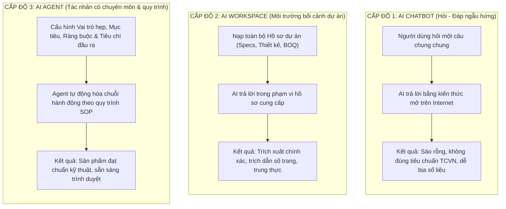

# GIÁO TRÌNH CHI TIẾT — BUỔI 01
## HIỂU ĐÚNG AI — XÂY DỰNG BỘ NÃO CHO DỰ ÁN
**Chuyên đề:** Từ công cụ hỏi đáp đơn thuần đến AI Workspace và AI Agent dự án xây dựng  
**Thời lượng chuẩn:** 150 phút (30% Lý thuyết & Kiến trúc — 70% Thực hành thực chiến)  
**Đơn vị đào tạo:** CES Global ([https://aec.cesglobal.com.vn/](https://aec.cesglobal.com.vn/))

---

## 1. MỤC TIÊU BÀI HỌC (LEARNING OBJECTIVES)

Sau khi hoàn thành Buổi 01, học viên đạt được các năng lực cốt lõi sau:
1. **Phân định bản chất công nghệ:** Hiểu rõ sự khác biệt giữa AI Chatbot (trò chuyện ngẫu hứng), AI Workspace (môi trường dữ liệu dự án có bối cảnh) và AI Agent (tác nhân tự hành có mục tiêu và quy trình).
2. **Làm chủ an toàn thông tin dự án:** Thiết lập các cấu hình bảo vệ dữ liệu (Data Controls / Zero-training) trên ChatGPT, Claude và Gemini; áp dụng quy trình làm mờ dữ liệu nhạy cảm (Data Masking) trước khi nạp vào AI.
3. **Triệt tiêu nguy cơ ảo giác (Zero-Hallucination):** Nắm vững cơ chế "Grounding" — buộc AI chỉ được trả lời dựa trên tài liệu cung cấp; thiết lập quy tắc vàng: *"Không đủ thông tin bắt buộc phải hỏi lại, tuyệt đối không suy đoán"*.
4. **Xây dựng Project Context Profile:** Tự tay số hóa các thông số nền tảng của một dự án xây dựng thành tệp bối cảnh chuẩn, làm "bộ nhớ dài hạn" cho AI.
5. **Cấu hình Agent 01:** Khởi tạo thành công **Agent 01 - Điều phối dự án (Project Orchestrator)** có khả năng nhận lệnh, phân tích yêu cầu và điều hướng công việc chuẩn xác.

---

## 2. TIẾN TRÌNH GIẢNG DẠY 150 PHÚT (PEDAGOGICAL TIMELINE)

```
00:00 ─── 00:15 (15') : Khởi động, Khảo sát hiện trạng & Đặt vấn đề
00:15 ─── 00:45 (30') : Kiến thức cốt lõi: 3 Tầng AI, Bảo mật dữ liệu & Bẫy ảo giác
00:45 ─── 01:15 (30') : Giảng viên thị phạm (Live Demo): Khởi tạo AI Workspace Dự án GreenTech Tower
01:15 ─── 02:10 (55') : Học viên thực hành Lab 01: Xây dựng Context Profile & Cấu hình Agent 01
02:10 ─── 02:30 (20') : Nghiệm thu chéo sản phẩm D1, sửa lỗi prompt & giao nhiệm vụ Buổi 02
```

---

## 3. KIẾN THỨC CỐT LÕI (CORE KNOWLEDGE — 30 PHÚT)

### 3.1. Ba Cấp Độ Ứng Dụng AI Trong Kỹ Thuật & Xây Dựng

Phần lớn kỹ sư hiện nay sử dụng AI ở cấp độ thấp nhất, dẫn đến kết quả hời hợt hoặc sai lệch:



### 3.2. An Toàn Thông Tin & Bảo Mật Dữ Liệu Công Trình

Nguyên tắc bất di bất dịch trong quản trị dự án: **Bảo vệ bí mật kinh doanh, giá dự thầu và thông số kỹ thuật độc quyền**.

1. **Cơ chế Data Controls (Tắt đào tạo mô hình):**
   - Trên tài khoản cá nhân: Luôn tắt tính năng *"Improve the model for everyone"* hoặc sử dụng phiên bản Doanh nghiệp (Enterprise/Team) có cam kết Zero Data Retention.
2. **Quy trình 3 Bước Làm Mờ Dữ Liệu Nhạy Cảm (Data Masking):**
   - **Bước 1 (Local Pre-Masking):** Trên máy tính nội bộ, thay thế các danh tính nhạy cảm bằng mã định danh (Ví dụ: Đổi tên Chủ đầu tư thành `[CHU_DAU_TU_A]`, giá gói thầu thành `[DON_GIA_X]`).
   - **Bước 2 (AI Processing):** Đưa văn bản đã mã hóa lên AI để phân tích cấu trúc, rà soát điều khoản hợp đồng hoặc lập bảng phân rã WBS.
   - **Bước 3 (Local Unmasking):** Tải kết quả về máy tính, dùng tính năng Replace (`Ctrl + H`) trong Word/Excel để đưa các thông tin thật trở lại tài liệu trước khi ký phát hành.

### 3.3. Cơ Chế Triệt Tiêu Ảo Giác (Zero-Hallucination Framework)

Mô hình AI vốn có xu hướng "lấp đầy khoảng trống" bằng cách dự đoán từ tiếp theo. Trong kỹ thuật xây dựng, việc AI tự ý đoán chiều dày sàn, mác bê tông hay đường kính cốt thép là sai lầm nguy hiểm có thể dẫn đến sự cố công trình.

**Công thức khóa chặt ảo giác trong System Prompt:**
> *"Bạn là Trợ lý Kỹ thuật độc quyền của Dự án. Bạn CHỈ ĐƯỢC PHÉP sử dụng các thông tin có trong tài liệu đính kèm. Nếu tài liệu không đề cập hoặc thông số bị mờ/thiếu, bạn BẮT BUỘC phải phản hồi: 'Tài liệu dự án không cung cấp thông số này, đề nghị kỹ sư kiểm tra lại hồ sơ gốc hoặc phát hành phiếu RFI'. TUYỆT ĐỐI KHÔNG tự tiện suy diễn số liệu."*

---

## 4. HƯỚNG DẪN THỊ PHẠM TRỰC TIẾP (LIVE DEMO — 30 PHÚT)

Giảng viên thực hiện thao tác trực tiếp trên màn hình chiếu:
1. **Bước 1:** Tạo một Project mới trên nền tảng AI (ChatGPT Projects / Claude Projects).
2. **Bước 2:** Soạn thảo tệp `00_Project_Context_Profile.md` cho công trình mẫu **GreenTech Tower** (Dự án văn phòng 15 tầng nổi, 2 tầng hầm tại Hà Nội).
3. **Bước 3:** Nạp Context Profile vào phần Project Instructions / Knowledge.
4. **Bước 4:** Cấu hình System Prompt cho **Agent 01 - Điều phối dự án**.
5. **Bước 5:** Thử nghiệm hai tình huống đối lập:
   - *Tình huống chuẩn:* Yêu cầu Agent tóm tắt thông số diện tích sàn tầng hầm từ Context Profile (Kết quả trả lời chính xác, trích dẫn mục cụ thể).
   - *Tình huống câu hỏi bẫy (Trap Question):* Hỏi: *"Độ sâu cọc khoan nhồi của dự án là bao nhiêu mét?"* (Trong Context chưa nạp phần cọc). Agent phản hồi chuẩn: *"Hồ sơ hiện tại chưa có thông số cọc, yêu cầu cung cấp thêm bản vẽ kết cấu móng"*.

---

## 5. NỘI DUNG BÀI THỰC HÀNH LAB 01 (HANDS-ON LAB — 55 PHÚT)

Học viên làm theo tài liệu [03_Huong_Dan_Thuc_Hanh_Lab_01.md](file:///f:/GitHub/Tai-lieu-khoa-hoc-ai-xay-dung/01_Buoi_01_Hieu_Dung_AI_Xay_Dung_Bo_Nao_Du_An/03_Huong_Dan_Thuc_Hanh_Lab_01.md):
- **Đề bài:** Thiết lập hoàn chỉnh AI Workspace và cấu hình Agent 01 cho một dự án cụ thể (dự án của học viên hoặc dự án mẫu GreenTech Tower).
- **Yêu cầu đầu ra:**
  - File Context Profile dự án chuẩn format Markdown.
  - Bộ System Prompt hoàn chỉnh của Agent 01 có cài đặt chốt chặn ảo giác.
  - Nhật ký kiểm thử vượt qua bài test câu hỏi bẫy.

---

## 6. NGHIỆM THU VÀ BÀI TẬP VỀ NHÀ (20 PHÚT)

1. **Nghiệm thu tại lớp:** Chấm điểm theo [04_Tieu_Chi_Nghiem_Thu_San_Pham_D1.md](file:///f:/GitHub/Tai-lieu-khoa-hoc-ai-xay-dung/01_Buoi_01_Hieu_Dung_AI_Xay_Dung_Bo_Nao_Du_An/04_Tieu_Chi_Nghiem_Thu_San_Pham_D1.md).
2. **Bài tập về nhà chuẩn bị cho Buổi 02:**
   - Chuẩn bị sẵn 01 bộ hồ sơ kỹ thuật (thuyết minh kiến trúc hoặc chỉ dẫn kỹ thuật dạng PDF dài 30-100 trang) để thực hành bóc tách và tạo Agent 02 ở buổi sau.
