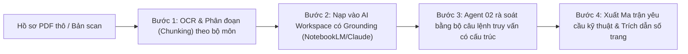

# GIÁO TRÌNH CHI TIẾT — BUỔI 02
## HỎI ĐÁP HÀNG TRĂM TRANG HỒ SƠ KỸ THUẬT TRONG VÀI PHÚT
**Chuyên đề:** Biến tập hồ sơ dự án, hồ sơ mời thầu và tiêu chuẩn kỹ thuật thành kho dữ liệu tra cứu thông minh  
**Thời lượng chuẩn:** 150 phút (30% Lý thuyết & Kiến trúc — 70% Thực hành thực chiến)  
**Đơn vị đào tạo:** CES Global ([https://aec.cesglobal.com.vn/](https://aec.cesglobal.com.vn/))

---

## 1. MỤC TIÊU BÀI HỌC (LEARNING OBJECTIVES)

Sau khi hoàn thành Buổi 02, học viên đạt được các năng lực chuyên môn sau:
1. **Làm chủ kỹ thuật tiền xử lý tài liệu kỹ thuật:** Nắm vững quy trình xử lý các định dạng hồ sơ hỗn hợp (PDF scan, bản vẽ PDF, bảng tính Excel, văn bản Word), ứng dụng OCR và hiểu rõ giới hạn độ dài ngữ cảnh (Context Window) của các mô hình LLM.
2. **Khai thác kho tri thức bằng Grounded Search:** Sử dụng các công cụ như NotebookLM, Claude Projects hoặc ChatGPT Projects để trích xuất thông tin có dẫn nguồn chính xác đến từng số trang, điều khoản hợp đồng.
3. **Phát hiện mâu thuẫn và xung đột hồ sơ:** Sử dụng AI để đối chiếu tự động giữa 03 nguồn dữ liệu: Hồ sơ mời thầu (HSMT), Chỉ dẫn kỹ thuật (Technical Specifications) và Thuyết minh bản vẽ thiết kế.
4. **Chuẩn hóa Ma trận yêu cầu kỹ thuật (Requirements Matrix):** Tự động bóc tách phạm vi công việc (Scope of Work - SOW), trách nhiệm kỹ thuật và các mốc nghiệm thu thành bảng quản trị trực quan.
5. **Cấu hình Agent 02:** Thiết lập hoàn chỉnh **Agent 02 - Hồ sơ kỹ thuật (Document & Spec Auditor)** có khả năng tự động soạn thảo Phiếu yêu cầu làm rõ thông tin (RFI - Request For Information) chuẩn thể thức hành chính kỹ thuật.

---

## 2. TIẾN TRÌNH GIẢNG DẠY 150 PHÚT (PEDAGOGICAL TIMELINE)

```
00:00 ─── 00:15 (15') : Ôn tập Buổi 01 & Nghiệm thu bổ sung D1
00:15 ─── 00:45 (30') : Kiến thức cốt lõi: Xử lý PDF dung lượng lớn, OCR & Kỹ thuật đối chiếu đa hồ sơ
00:45 ─── 01:15 (30') : Giảng viên thị phạm (Live Demo): Nạp 150 trang Chỉ dẫn kỹ thuật & Bóc tách mâu thuẫn PCCC
01:15 ─── 02:10 (55') : Học viên thực hành Lab 02: Cấu hình Agent 02, Lập Ma trận yêu cầu & Soạn RFI
02:10 ─── 02:30 (20') : Trình bày chéo sản phẩm D2, chấm điểm theo Rubric & hướng dẫn chuẩn bị Buổi 03
```

---

## 3. KIẾN THỨC CỐT LÕI (CORE KNOWLEDGE — 30 PHÚT)

### 3.1. Thách Thức Khi Đọc Hồ Sơ Xây Dựng Bằng AI & Giải Pháp Xử Lý

Tài liệu ngành xây dựng có những đặc thù phức tạp mà các prompt thông thường không thể xử lý:
- **Tài liệu scan và chữ ký số:** Các file PDF xuất từ máy scan là dạng ảnh (Raster image), AI không thể đọc trực tiếp văn bản nếu không qua bước OCR (Optical Character Recognition).
- **Văn bản phân mảnh:** Một công trình có hàng chục bộ hồ sơ: Thuyết minh chung, Chỉ dẫn cọc, Kết cấu bê tông cốt thép, Hoàn thiện, Cơ điện (MEP), Phòng cháy chữa cháy (PCCC).
- **Hiện tượng "Lạc trôi thông tin" (Lost in the middle):** Khi nạp file quá dài (trên 300 trang), AI có xu hướng ghi nhớ tốt đoạn đầu và đoạn cuối nhưng bỏ sót các điều khoản quan trọng ở giữa.



### 3.2. Phương Pháp Lập Ma Trận Yêu Cầu Kỹ Thuật (Requirements Matrix)

Ma trận yêu cầu kỹ thuật là công cụ bắt buộc của kỹ sư đấu thầu và kỹ sư kỹ thuật hiện trường. Thay vì phải đọc thủ công từng trang, Kỹ sư hướng dẫn Agent 02 bóc tách theo 5 cột tiêu chuẩn:

| Cột 1: Hạng mục / Cấu phần | Cột 2: Yêu cầu chỉ dẫn kỹ thuật | Cột 3: Tiêu chuẩn nghiệm thu áp dụng | Cột 4: Hồ sơ nghiệm thu đầu vào | Cột 5: Trích dẫn số trang / Điều khoản |
| :--- | :--- | :--- | :--- | :--- |
| *Bê tông vách hầm* | Mác B35, độ chống thấm W10, phụ gia bù co ngót | TCVN 5574:2018, TCVN 3118:1993 | Kết quả nén mẫu 7 ngày, 28 ngày; Chứng chỉ xuất xưởng xi măng | Mục 3.2.1, Trang 48, Chỉ dẫn kỹ thuật Tập 2 |
| *Cửa chống cháy* | Cửa thép chống cháy EI 90, tự động đóng | QCVN 06:2022/BXD, TCVN 9383:2012 | Giấy chứng nhận kiểm định của Cục Cảnh sát PCCC & CNCH | Bản vẽ KT-401, Thuyết minh Kiến trúc trang 12 |

### 3.3. Kỹ Thuật Soạn Thảo Phiếu RFI (Request For Information) Chuẩn Mực

Khi phát hiện mâu thuẫn giữa bản vẽ và chỉ dẫn kỹ thuật (ví dụ: Bản vẽ ghi cửa EI 60 nhưng Thuyết minh PCCC ghi EI 90), kỹ sư tuyệt đối không được tự ý thi công mà phải phát hành Phiếu RFI.

**Cấu trúc 4 phần của một Phiếu RFI chuẩn kỹ thuật:**
1. **Vấn đề phát hiện (Issue Identification):** Nêu rõ sự khác biệt giữa hai tài liệu kèm số hiệu bản vẽ, số trang chỉ dẫn kỹ thuật.
2. **Tác động kỹ thuật & Pháp lý (Impact Analysis):** Phân tích hậu quả nếu áp dụng sai (nguy cơ không được nghiệm thu PCCC hoặc đội chi phí vật tư).
3. **Đề xuất của Nhà thầu / Kỹ sư (Proposed Solution):** Đưa ra 1 hoặc 2 phương án xử lý khả thi để Chủ đầu tư và Tư vấn lựa chọn.
4. **Thời hạn phản hồi yêu cầu (Required Response Date):** Xác định mốc thời gian cần trả lời để không làm gián đoạn tiến độ công trường.

---

## 4. THỊ PHẠM TRỰC TIẾP (LIVE DEMO — 30 PHÚT)

Giảng viên thực hiện các thao tác:
1. **Nạp tài liệu:** Tải lên tệp `Chi_Dan_Ky_Thuat_GreenTech_Tower_PCCC.pdf` (hồ sơ mẫu 85 trang).
2. **Kích hoạt Agent 02:** Sử dụng Prompt rà soát mâu thuẫn để Agent quét toàn bộ nội dung cửa chống cháy và vật liệu ngăn cháy.
3. **Phát hiện xung đột:** Agent 02 chỉ ra mâu thuẫn:
   - *Tài liệu A (Thuyết minh PCCC - Trang 34):* Cửa vào buồng thang bộ thoát hiểm yêu cầu ngăn cháy EI 90.
   - *Tài liệu B (Bản vẽ mặt bằng kiến trúc tầng 2 - KT-102):* Ký hiệu cửa là D-08 (Ghi chú EI 60).
4. **Sinh phiếu RFI:** Yêu cầu Agent 02 soạn thảo Phiếu RFI số 01 gửi Tư vấn thiết kế V-Design để làm rõ trước khi đặt hàng sản xuất.

---

## 5. NỘI DUNG THỰC HÀNH LAB 02 (55 PHÚT)

Học viên làm theo tài liệu [03_Huong_Dan_Thuc_Hanh_Lab_02.md](file:///f:/GitHub/Tai-lieu-khoa-hoc-ai-xay-dung/02_Buoi_02_Khai_Thac_Ho_So_Ky_Thuat/03_Huong_Dan_Thuc_Hanh_Lab_02.md):
- Thiết lập System Prompt cho Agent 02.
- Thực hành nạp tệp hồ sơ kỹ thuật mẫu.
- Chạy câu lệnh tạo Ma trận yêu cầu kỹ thuật và soạn thảo 01 Phiếu RFI hoàn chỉnh.

---

## 6. NGHIỆM THU VÀ BÀI TẬP VỀ NHÀ (20 PHÚT)

- Đánh giá sản phẩm D2 theo [04_Tieu_Chi_Nghiem_Thu_San_Pham_D2.md](file:///f:/GitHub/Tai-lieu-khoa-hoc-ai-xay-dung/02_Buoi_02_Khai_Thac_Ho_So_Ky_Thuat/04_Tieu_Chi_Nghiem_Thu_San_Pham_D2.md).
- Bài tập về nhà: Chuẩn bị 01 bài toán công năng kiến trúc hoặc mặt bằng khu đất để chuẩn bị cho Buổi 03 (Hỗ trợ thiết kế & Điều khiển AutoCAD).
