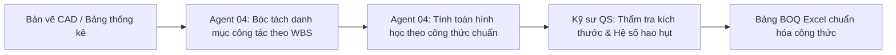

# GIÁO TRÌNH CHI TIẾT — BUỔI 04
## AI CHO BOQ, DỰ TOÁN VÀ KIỂM SOÁT CHI PHÍ ĐẦU TƯ
**Chuyên đề:** Từ hồ sơ thiết kế đến Bảng tiên lượng khối lượng (BOQ), đối soát đa báo giá và kiểm soát ngân sách  
**Thời lượng chuẩn:** 150 phút (30% Lý thuyết & Kiến trúc — 70% Thực hành thực chiến)  
**Đơn vị đào tạo:** CES Global ([https://aec.cesglobal.com.vn/](https://aec.cesglobal.com.vn/))

---

## 1. MỤC TIÊU BÀI HỌC (LEARNING OBJECTIVES)

Sau khi hoàn thành Buổi 04, học viên đạt được các năng lực chuyên môn sau:
1. **Làm chủ quy trình bóc tách khối lượng bằng AI:** Sử dụng AI để đọc bản vẽ, bảng thống kê và thuyết minh nhằm lập danh mục công tác bóc tách khối lượng (Bill of Quantities - BOQ) một cách bài bản, logic.
2. **Triệt tiêu nguyên tắc "đoán mò" khối lượng (Anti-Guesswork Rule):** Hiểu rõ ranh giới an toàn: AI không được tự tiện giả định kích thước hình học hoặc tỷ lệ khi bản vẽ không thể hiện; bắt buộc phải gắn cờ cảnh báo để Kỹ sư QS xác minh.
3. **Chuẩn hóa cấu trúc BOQ trên Excel:** Ứng dụng AI để phân loại mã hiệu công tác, đơn vị tính chuẩn (m³, m², tấn, cái) và thiết lập công thức tính toán tự động, chống lỗi dồn chữ đè dòng.
4. **Tự động hóa đối soát và phân tích chào giá nhà thầu:** So sánh bảng báo giá của 3-5 nhà thầu phụ/nhà cung cấp, bóc tách chênh lệch đơn giá, phát hiện các điều khoản thương mại bất lợi và chi phí ẩn.
5. **Cấu hình Agent 04:** Thiết lập **Agent 04 - Kỹ sư QS & Chi phí (Cost & QS Specialist)** trở thành trợ lý đắc lực trong công tác đấu thầu và thanh quyết toán dự án.

---

## 2. TIẾN TRÌNH GIẢNG DẠY 150 PHÚT (PEDAGOGICAL TIMELINE)

```
00:00 ─── 00:15 (15') : Ôn tập Buổi 03 & Nghiệm thu sản phẩm D3 (Bản vẽ CAD hệ cột & lưới trục)
00:15 ─── 00:45 (30') : Kiến thức cốt lõi: Phương pháp đo bóc bằng AI, Nguyên tắc Anti-Guesswork & Đối soát báo giá
00:45 ─── 01:15 (30') : Giảng viên thị phạm (Live Demo): Bóc tách 30 cột GreenTech Tower & Đối chiếu 3 bảng chào thầu bê tông
01:15 ─── 02:10 (55') : Học viên thực hành Lab 04: Lập bảng BOQ chuẩn hóa trên Excel & Phân tích chênh lệch ngân sách
02:10 ─── 02:30 (20') : Chấm điểm chéo sản phẩm D4 theo Rubric, giải đáp bẫy hao hụt vật tư & Giao bài Buổi 05
```

---

## 3. KIẾN THỨC CỐT LÕI (CORE KNOWLEDGE — 30 PHÚT)

### 3.1. Phương Pháp Luận Đo Bóc Khối Lượng Có Sự Hỗ Trợ Của AI

Công tác đo bóc khối lượng (Quantity Surveying) là huyết mạch tài chính của dự án. Sai lệch 5% khối lượng bê tông hay cốt thép có thể làm bay hơi toàn bộ lợi nhuận của nhà thầu.



**Ba nguyên tắc vàng khi dùng AI cho BOQ:**
1. **Phân rã theo đúng mã hiệu định mức:** AI phải tách biệt rõ ràng công tác Bê tông (m³), Ván khuôn (m²), Cốt thép (tấn) theo từng cấu kiện (móng, cột, dầm, sàn).
2. **Nguyên tắc "Anti-Guesswork":** Khi một cấu kiện thiếu chiều cao dầm hoặc thiếu chiều dày lớp hoàn thiện, AI phải ghi chú: `[THIẾU KÍCH THƯỚC - ĐỀ NGHỊ XÁC MINH TRÊN BẢN VẼ CHI TIẾT]`. Kỹ sư QS tuyệt đối không chấp nhận các con số ước lượng vô căn cứ.
3. **Hệ số hao hụt và biện pháp thi công:** AI chỉ tính toán khối lượng hình học thuần túy (Net Quantity). Kỹ sư QS là người áp dụng định mức hao hụt vật tư (theo Thông tư 12/2021/TT-BXD) và khối lượng biện pháp phụ trợ.

### 3.2. Cấu Trúc Chuẩn Hóa Bảng BOQ Tránh Lỗi Định Dạng

Tuân thủ nghiêm ngặt quy tắc quản trị bảng tính doanh nghiệp:
- Cột A: STT ngắn gọn (width 6-8, căn giữa).
- Cột B: Mã hiệu công tác / Định mức.
- Cột C: Nội dung công tác kỹ thuật (mô tả rõ mác, quy cách, kích thước).
- Cột D: Đơn vị tính (m³, m², tấn, md, cái...).
- Cột E: Khối lượng (định dạng số `#,,##0.00`, căn phải).
- Cột F: Đơn vị tính diễn giải chi tiết công thức (Dài x Rộng x Cao x Số lượng).
- Cột G: Ghi chú kỹ thuật & Bản vẽ tham chiếu.

### 3.3. Phương Pháp Đối Soát Báo Giá Đa Nhà Thầu (Bid Equalization)

Khi nhận 3 báo giá từ các nhà thầu phụ khác nhau, Kỹ sư QS thường gặp tình trạng "so sánh quả táo với quả cam" do mỗi nhà thầu báo giá theo cách riêng:
- Nhà thầu A: Báo đơn giá bê tông đã gồm bơm và phụ gia đông kết nhanh.
- Nhà thầu B: Báo đơn giá vật tư riêng, tiền ca bơm tính riêng theo khối lượng thực tế.
- Nhà thầu C: Báo giá rẻ hơn nhưng điều khoản thanh toán phạt trả chậm rất gắt gao.

**Agent 04 đóng vai trò "Bộ lọc chuẩn hóa":** Đưa tất cả các báo giá về cùng một mặt bằng so sánh (Normalized Baseline), làm nổi bật chi phí tổng thể và các rủi ro phát sinh trong hợp đồng thương mại.

---

## 4. HƯỚNG DẪN THỊ PHẠM TRỰC TIẾP (LIVE DEMO — 30 PHÚT)

Giảng viên thị phạm trực tiếp trên hệ thống:
1. **Đầu vào:** Bản vẽ hệ 30 cột tầng 1 GreenTech Tower vừa hoàn thành ở Buổi 03 (30 cột 800x800mm, chiều cao tầng $H = 5.4\text{ m}$).
2. **Kích hoạt Agent 04:**
   - Yêu cầu tính toán khối lượng bê tông cột: $V = 30 \times (0.8 \times 0.8 \times 5.4) = 103.68\text{ m³}$.
   - Yêu cầu tính toán diện tích ván khuôn cột: Chu vi mỗi cột $P = (0.8 + 0.8) \times 2 = 3.2\text{ m}$. Diện tích ván khuôn 1 cột: $3.2 \times 5.4 = 17.28\text{ m²}$. Tổng ván khuôn 30 cột: $17.28 \times 30 = 518.40\text{ m²}$.
3. **Đối soát 3 bảng báo giá bê tông thương phẩm B35:**
   - Nạp dữ liệu báo giá của 3 trạm trộn (Trạm Việt Đức, Trạm Chèm, Trạm Vĩnh Tuy).
   - Agent 04 tự động lập bảng so sánh ma trận đơn giá vật tư, phí ca bơm, phí phụ gia và tiến độ cấp hàng.
4. **Phát hiện bẫy:** Agent 04 chỉ ra Trạm Vĩnh Tuy có đơn giá vật tư rẻ nhất nhưng phụ phí ca bơm cho khối lượng dưới 50m³ lại cao gấp đôi, khiến tổng chi phí thực tế cao hơn Trạm Việt Đức!

---

## 5. NỘI DUNG THỰC HÀNH LAB 04 (55 PHÚT)

Học viên làm theo tài liệu [03_Huong_Dan_Thuc_Hanh_Lab_04_BOQ.md](file:///f:/GitHub/Tai-lieu-khoa-hoc-ai-xay-dung/04_Buoi_04_Boc_Tach_Khoi_Luong_BOQ_Du_Toan/03_Huong_Dan_Thuc_Hanh_Lab_04_BOQ.md):
- Thiết lập System Prompt cho Agent 04.
- Lập bảng tính BOQ bê tông và ván khuôn cho kết cấu tầng 1 GreenTech Tower.
- Tiến hành phân tích đối soát báo giá thầu phụ và lập Báo cáo đề xuất lựa chọn nhà thầu.

---

## 6. NGHIỆM THU VÀ BÀI TẬP VỀ NHÀ (20 PHÚT)

- Đánh giá sản phẩm D4 theo [04_Tieu_Chi_Nghiem_Thu_San_Pham_D4.md](file:///f:/GitHub/Tai-lieu-khoa-hoc-ai-xay-dung/04_Buoi_04_Boc_Tach_Khoi_Luong_BOQ_Du_Toan/04_Tieu_Chi_Nghiem_Thu_San_Pham_D4.md).
- Chuẩn bị cho Buổi 05: Sử dụng khối lượng BOQ và danh mục công tác để lập kế hoạch tiến độ WBS và nhật ký công trình.
