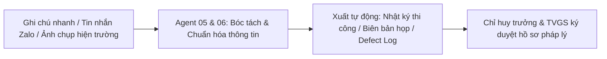

# GIÁO TRÌNH CHI TIẾT — BUỔI 05
## TRỢ LÝ AI QUẢN LÝ DỰ ÁN, TIẾN ĐỘ, QA/QC & AN TOÀN LAO ĐỘNG
**Chuyên đề:** Điều độ công trường, tự động hóa nhật ký thi công, kiểm soát chất lượng và quản trị rủi ro HSE  
**Thời lượng chuẩn:** 150 phút (30% Lý thuyết & Kiến trúc — 70% Thực hành thực chiến)  
**Đơn vị đào tạo:** CES Global ([https://aec.cesglobal.com.vn/](https://aec.cesglobal.com.vn/))

---

## 1. MỤC TIÊU BÀI HỌC (LEARNING OBJECTIVES)

Sau khi hoàn thành Buổi 05, học viên đạt được các năng lực chuyên môn sau:
1. **Làm chủ quy trình điều độ tiến độ thi công:** Chuyển đổi cơ cấu phân rã công việc (WBS) thành kế hoạch tiến độ cuốn chiếu 2-4 tuần (Lookahead Schedule), nhận diện đường găng (Critical Path) và nguy cơ trễ hạn.
2. **Tự động hóa hoàn toàn Nhật ký công trình:** Chuyển hóa các mẩu tin nhắn nhanh, hình ảnh chụp và ghi chép hiện trường rời rạc của kỹ sư giám sát thành Biên bản Nhật ký thi công hợp pháp tuân thủ Nghị định 06/2021/NĐ-CP.
3. **Soạn thảo Biên bản họp giao ban chuyên nghiệp:** Tự động tổng hợp ý kiến của Chủ đầu tư, Tư vấn giám sát và các nhà thầu thành biên bản họp điều hành có gắn nhãn phân định trách nhiệm (RACI Matrix) và thời hạn giải quyết dứt điểm.
4. **Quản trị chất lượng & rủi ro hiện trường (QA/QC & HSE):** Ứng dụng AI xây dựng Danh mục theo dõi lỗi thi công (Defect Tracking Log) và Bảng quản trị rủi ro công trường (Risk Register) theo chuẩn quốc tế.
5. **Cấu hình Agent 05 và Agent 06:** Thiết lập **Agent 05 (Tiến độ - Báo cáo)** và **Agent 06 (QA/QC & HSE)** phối hợp nhịp nhàng trên công trường.

---

## 2. TIẾN TRÌNH GIẢNG DẠY 150 PHÚT (PEDAGOGICAL TIMELINE)

```
00:00 ─── 00:15 (15') : Ôn tập Buổi 04 & Nghiệm thu sản phẩm D4 (BOQ & Phân tích so sánh báo giá)
00:15 ─── 00:45 (30') : Kiến thức cốt lõi: Tự động hóa nhật ký hiện trường, Quản trị tiến độ Lookahead & Risk Register
00:45 ─── 01:15 (30') : Giảng viên thị phạm (Live Demo): Biến tin nhắn thoại hiện trường thành Nhật ký thi công & Biên bản họp
01:15 ─── 02:10 (55') : Học viên thực hành Lab 05: Xử lý tình huống sự cố mưa bão sạt lở hố móng, lập Risk Register
02:10 ─── 02:30 (20') : Chấm điểm chéo sản phẩm D5, phân tích nguyên tắc pháp lý nhật ký & Giao bài Buổi 06
```

---

## 3. KIẾN THỨC CỐT LÕI (CORE KNOWLEDGE — 30 PHÚT)

### 3.1. Thực Trạng Quản Trị Hiện Trường & "Nỗi Đau" Của Kỹ Sư

Tại hầu hết các công trường xây dựng:
- Kỹ sư mất 1-2 tiếng mỗi tối sau giờ làm mệt mỏi chỉ để chép tay hoặc đánh máy lại Nhật ký thi công.
- Biên bản họp giao ban thường ghi chung chung: *"Các bên cố gắng đẩy nhanh tiến độ"*, thiếu người chịu trách nhiệm đích danh và thời hạn hoàn thành cụ thể.
- Lỗi chất lượng (nứt bê tông, rỗ mặt, đặt sai thép) chỉ được trao đổi miệng hoặc qua Zalo, dễ bị trôi tin nhắn và bị bỏ quên đến ngày nghiệm thu.



### 3.2. Cấu Trúc Nhật Ký Thi Công Hợp Pháp Theo Nghị Định 06/2021/NĐ-CP

Một trang nhật ký công trình chuẩn mực pháp lý phải hội đủ 5 cấu phần:
1. **Điều kiện khí hậu, thời tiết:** Nhiệt độ, lượng mưa (buổi sáng/chiều), ảnh hưởng đến công tác đổ bê tông hoặc đào đất.
2. **Tình hình nhân lực & Thiết bị thực tế:** Số lượng thợ của từng tổ đội (cốt thép, ván khuôn, thợ nề, thợ điện), danh mục máy móc hoạt động / ngừng hoạt động.
3. **Chi tiết các công việc triển khai trong ngày:** Vị trí cấu kiện thi công (trục, tầng), khối lượng hoàn thành ước tính.
4. **Công tác kiểm tra, nghiệm thu chất lượng (QA/QC):** Các biên bản nghiệm thu nội bộ và nghiệm thu với TVGS được ký trong ngày; kết quả lấy mẫu thí nghiệm.
5. **Các vấn đề phát sinh, an toàn lao động (HSE) & Chỉ đạo của TVGS/CĐT.**

### 3.3. Phương Pháp Luận Quản Trị Rủi Ro Dự Án (Risk Register)

Không chỉ ghi nhận sự việc đã rồi, kỹ sư hiện trường hiện đại phải biết dự báo rủi ro:
- **Ma trận Xác suất - Mức độ tác động ($P \times I$):** Đánh giá nguy cơ từ Thấp (1-4), Trung bình (5-9) đến Cao/Nghiêm trọng (10-25).
- **Chiến lược ứng phó:** Tránh né (Avoidance), Chuyển giao (Transference), Giảm thiểu (Mitigation), hoặc Chấp nhận (Acceptance).
- **Chủ sở hữu rủi ro (Risk Owner):** Phân định đích danh người chịu trách nhiệm theo dõi và hành động.

---

## 4. HƯỚNG DẪN THỊ PHẠM TRỰC TIẾP (LIVE DEMO — 30 PHÚT)

Giảng viên thị phạm tình huống thực tế:
1. **Dữ liệu thô từ hiện trường:**
   > *"Hôm nay 20/11/2026, trời mưa to từ 14h đến 17h. Sáng thợ buộc thép móng trục 1-3 được 80%. Đổ bê tông lót hố pít thang máy được 15m3. Chiều mưa to phải dừng thi công ngoài trời, chuyển 12 thợ vào gia công thép trong lán trại. Có 1 xe cuốc Komatsu 0.8m3 bị hỏng bơm thủy lực lúc 11h. Giám sát DeltaCon lập biên bản nhắc nhở công nhân tổ mộc không đeo dây an toàn khi lắp giáo ngoài."*
2. **Kích hoạt Agent 05 và Agent 06:**
   - Agent 05 tự động biên soạn thành **Bản Nhật ký thi công ngày 20/11/2026** chuẩn 5 mục hành chính, ngôn từ trang trọng.
   - Agent 06 tự động trích xuất lỗi an toàn vào **Bảng theo dõi lỗi QA/QC-HSE (Defect Log)**, gán hạn khắc phục là 08h00 sáng hôm sau.
3. **Sinh Biên bản họp giao ban công trường:**
   - Yêu cầu Agent 05 lập biên bản phân định rõ trách nhiệm của Đội trưởng mộc và Đội cơ giới.

---

## 5. NỘI DUNG THỰC HÀNH LAB 05 (55 PHÚT)

Học viên làm theo tài liệu [03_Huong_Dan_Thuc_Hanh_Lab_05_PM_QAQC.md](file:///f:/GitHub/Tai-lieu-khoa-hoc-ai-xay-dung/05_Buoi_05_Quan_Ly_Du_An_Tien_Do_QAQC_HSE/03_Huong_Dan_Thuc_Hanh_Lab_05_PM_QAQC.md):
- Thiết lập cấu hình cho cả hai Agent: Agent 05 và Agent 06.
- Thực hành xử lý tình huống phát sinh sự cố tại hố móng GreenTech Tower.
- Xuất Nhật ký thi công ngày, Biên bản xử lý hiện trường và Bảng quản trị rủi ro Risk Register.

---

## 6. NGHIỆM THU VÀ BÀI TẬP VỀ NHÀ (20 PHÚT)

- Đánh giá sản phẩm D5 theo [04_Tieu_Chi_Nghiem_Thu_San_Pham_D5.md](file:///f:/GitHub/Tai-lieu-khoa-hoc-ai-xay-dung/05_Buoi_05_Quan_Ly_Du_An_Tien_Do_QAQC_HSE/04_Tieu_Chi_Nghiem_Thu_San_Pham_D5.md).
- Chuẩn bị cho Buổi 06 (Buổi tốt nghiệp): Kết nối toàn bộ 6 Agent vào một quy trình tự động hóa khép kín và hoàn thiện Đồ án tốt nghiệp cuối khóa.
