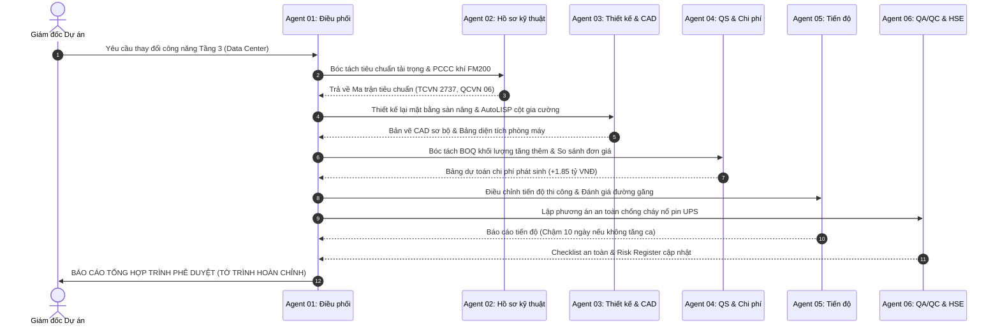

# GIÁO TRÌNH CHI TIẾT — BUỔI 06
## XÂY DỰNG ĐỘI NGŨ AI AGENT CHO DOANH NGHIỆP XÂY DỰNG
**Chuyên đề:** Tích hợp hệ sinh thái Multi-Agent, quy trình SOP doanh nghiệp và Đồ án tốt nghiệp thực chiến  
**Thời lượng chuẩn:** 150 phút (30% Lý thuyết & Kiến trúc — 70% Thực hành đồ án tốt nghiệp)  
**Đơn vị đào tạo:** CES Global ([https://aec.cesglobal.com.vn/](https://aec.cesglobal.com.vn/))

---

## 1. MỤC TIÊU BÀI HỌC (LEARNING OBJECTIVES)

Sau khi hoàn thành Buổi 06 (Buổi tốt nghiệp toàn khóa), học viên đạt được các năng lực đỉnh cao:
1. **Làm chủ kiến trúc điều phối đa tác nhân (Multi-Agent Orchestration):** Kết nối độc lập 6 Agent đã xây dựng từ các buổi trước thành một cỗ máy làm việc đồng bộ, tự động chuyển tiếp dữ liệu qua giao thức bàn giao (Handoff Protocol).
2. **Thiết lập Quy trình Vận hành Tiêu chuẩn (SOP) cho Doanh nghiệp:** Xây dựng khung quy trình ứng dụng AI cho các phòng ban: Phòng Đấu thầu, Phòng Thiết kế, Phòng QS - Dự toán, Ban Chỉ huy công trường và Ban Giám đốc.
3. **Quản trị an toàn thông tin & Phân quyền vai trò (RBAC):** Thiết lập cơ chế kiểm soát dữ liệu nhạy cảm theo phân cấp quyền hạn (Giám đốc xem toàn bộ, Kỹ sư hiện trường chỉ xem phần việc liên quan), bảo vệ tuyệt đối bí mật kinh doanh của nhà thầu.
4. **Xử lý tình huống khủng hoảng kỹ thuật toàn diện:** Vận hành trơn tru cả 6 Agent để giải quyết bài toán thay đổi thiết kế đột xuất và phát sinh chi phí trong Đồ án tốt nghiệp (Capstone Project).
5. **Hoàn thiện Bộ tài sản số Doanh nghiệp (Enterprise AI Assets):** Đóng gói trọn vẹn 01 AI Workspace + 06 Agent chuyên môn + Thư viện Promptbook doanh nghiệp + Bộ biểu mẫu kỹ thuật chuẩn hóa.

---

## 2. TIẾN TRÌNH GIẢNG DẠY 150 PHÚT (PEDAGOGICAL TIMELINE)

```
00:00 ─── 00:15 (15') : Ôn tập Buổi 05 & Nghiệm thu sản phẩm D5 (Nhật ký thi công & Risk Register)
00:15 ─── 00:45 (30') : Kiến thức cốt lõi: Kiến trúc Multi-Agent Handoff, SOP Doanh nghiệp & Chiến lược triển khai
00:45 ─── 01:15 (30') : Giảng viên thị phạm (Live Demo): Kích hoạt chuỗi Handoff 6 Agent xử lý tình huống khẩn cấp
01:15 ─── 02:10 (55') : Học viên thực hành Đồ án Tốt nghiệp (Capstone Lab 06): Xử lý tình huống thay đổi thiết kế Tầng 3
02:10 ─── 02:30 (20') : Báo cáo Đồ án tốt nghiệp, Hội đồng chấm điểm theo Rubric D6 & Tổng kết khóa học
```

---

## 3. KIẾN THỨC CỐT LÕI (CORE KNOWLEDGE — 30 PHÚT)

### 3.1. Cơ Chế Chuyển Tiếp Dữ Liệu Liên Tác Nhân (Agent Handoff Protocol)

Trong môi trường doanh nghiệp, một Agent đơn lẻ không thể giải quyết trọn vẹn bài toán. Cần có một giao thức bàn giao dữ liệu chuẩn mực giữa các tác nhân chuyên môn:



### 3.2. Quy Trình Vận Hành Chuẩn (SOP) Ứng Dụng AI Tại Doanh Nghiệp Xây Dựng

Để AI thực sự tạo ra giá trị kinh tế và không gây rủi ro pháp lý, doanh nghiệp cần ban hành Quy chế vận hành gồm 3 nguyên tắc:
1. **Nguyên tắc "Cửa ải kiểm duyệt kép" (Dual Verification Gate):**
   - Mọi bản nháp do AI sinh ra (hợp đồng, BOQ, bản vẽ CAD) bắt buộc phải qua 2 vòng kiểm soát: Kỹ sư trực tiếp phụ trách kiểm tra số liệu (Gate 1) và Trưởng phòng/Chỉ huy trưởng ký duyệt (Gate 2).
2. **Phân quyền dữ liệu theo vai trò (Role-Based Access Control):**
   - Không nạp toàn bộ dữ liệu tài chính công ty vào các tài khoản AI miễn phí.
   - Tài liệu chiến lược giá chỉ được lưu hành trong Workspace nội bộ của Ban Giám đốc và Trưởng phòng Đấu thầu.
3. **Quy chế cập nhật tri thức định kỳ (Knowledge Base Maintenance):**
   - Hàng tháng, các định mức thi công mới, giá vật liệu thị trường và bài học kinh nghiệm công trường phải được cập nhật vào tệp Context Profile của công ty.

---

## 4. HƯỚNG DẪN THỊ PHẠM TRỰC TIẾP (LIVE DEMO — 30 PHÚT)

Giảng viên trình diễn "Chuỗi tác chiến 6 Agent trong 10 phút":
1. Nhập một mệnh lệnh duy nhất cho **Agent 01**:
   > *"Chủ đầu tư vừa gửi công văn yêu cầu điều chỉnh một phần Tầng 3 thành Trung tâm Dữ liệu. Hãy kích hoạt quy trình Handoff cho toàn bộ các Agent để đánh giá tác động và lập Tờ trình xử lý phát sinh."*
2. Quan sát Agent 01 phân rã nhiệm vụ và phối hợp tuần tự:
   - Agent 02 trích xuất quy chuẩn sàn Data Center tải trọng $1200\text{ kg/m²}$ (thay vì $400\text{ kg/m²}$ của văn phòng thông thường).
   - Agent 03 đề xuất giải pháp dầm phụ gia cường và sinh script CAD.
   - Agent 04 bóc tách chi phí phát sinh hệ thống sàn nâng và phòng cháy khí FM200.
   - Agent 05 và 06 cập nhật lịch thi công và biện pháp phòng ngừa rủi ro.
3. Xuất Tờ trình tổng hợp hoàn hảo gửi Giám đốc dự án.

---

## 5. BÀI THỰC HÀNH ĐỒ ÁN TỐT NGHIỆP (CAPSTONE LAB 06 — 55 PHÚT)

Học viên làm theo tài liệu [03_Huong_Dan_Thuc_Hanh_Lab_06_He_Thong.md](file:///f:/GitHub/Tai-lieu-khoa-hoc-ai-xay-dung/06_Buoi_06_He_Thong_6_Agent_Doanh_Nghiep/03_Huong_Dan_Thuc_Hanh_Lab_06_He_Thong.md):
- Học viên vận hành toàn bộ AI Workspace GreenTech Tower.
- Đóng vai trò Giám đốc Quản lý Dự án, điều phối chuỗi hành động để hoàn thành Đồ án tốt nghiệp.
- Xuất Bộ hồ sơ đồ án tốt nghiệp D6 hoàn chỉnh.

---

## 6. BÁO CÁO TỐT NGHIỆP & TRAO CHỨNG NHẬN (20 PHÚT)

- Các nhóm trình bày Đồ án tốt nghiệp.
- Hội đồng chuyên môn CES Global đánh giá và công bố điểm theo [04_Tieu_Chi_Nghiem_Thu_Tot_Nghiep_D6.md](file:///f:/GitHub/Tai-lieu-khoa-hoc-ai-xay-dung/06_Buoi_06_He_Thong_6_Agent_Doanh_Nghiep/04_Tieu_Chi_Nghiem_Thu_Tot_Nghiep_D6.md).
- Trao Chứng chỉ Chuyên gia AI Agent trong Kỹ thuật & Xây dựng và gói quà tặng VIP LMS/Premium Academy.
