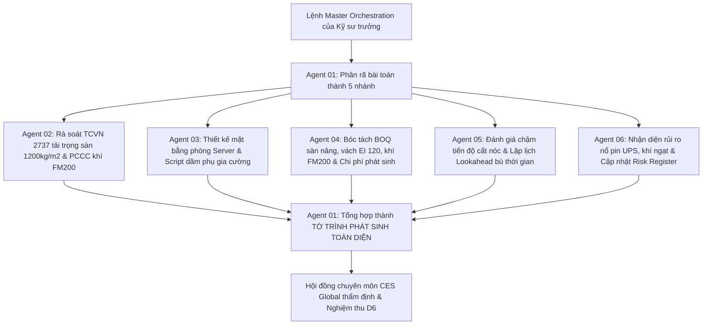

# TÀI LIỆU HƯỚNG DẪN BÀI THỰC HÀNH LAB 06 (CAPSTONE PROJECT)
## VẬN HÀNH HỆ SINH THÁI 6 AI AGENT & BẢO VỆ ĐỒ ÁN TỐT NGHIỆP
**Thời lượng thực hành:** 55 phút  
**Sản phẩm nghiệm thu (Deliverable D6):** Bộ Hồ sơ Đồ án Tốt nghiệp + Tờ trình Phương án Multi-Agent + Quy trình SOP Doanh nghiệp  
**Đơn vị đào tạo:** CES Global ([https://aec.cesglobal.com.vn/](https://aec.cesglobal.com.vn/))

---

## 1. MỤC TIÊU BÀI LAB 06 (ĐỒ ÁN TỐT NGHIỆP)
- Kết nối toàn diện 6 AI Agent đã xây dựng qua 5 buổi học trước thành một quy trình tác chiến khép kín.
- Thực hành đóng vai Ban Giám đốc Dự án và Kỹ sư trưởng, vận hành chuỗi chuyển tiếp thông tin (Agent Handoff) giải quyết trọn vẹn một bài toán khủng hoảng kỹ thuật lớn: **Chủ đầu tư yêu cầu thay đổi thiết kế khẩn cấp công năng Tầng 3 thành Trung tâm dữ liệu Data Center**.
- Hoàn thiện và đóng gói toàn bộ sản phẩm thực hành thành **Bộ Hồ sơ Đồ án Tốt nghiệp khóa học**.

---

## 2. ĐỀ BÀI TÌNH HUỐNG TỐT NGHIỆP (CAPSTONE SCENARIO)

> **CÔNG VĂN ĐỀ NGHỊ THAY ĐỔI THIẾT KẾ TỪ CHỦ ĐẦU TƯ GREENTECH INVEST:**
> *"Kính gửi Tổng thầu BMTECK SOLUTION và Ban Quản lý Dự án GreenTech Tower,  
> Căn cứ định hướng phát triển hạ tầng số của Tập đoàn, Chúng tôi quyết định chuyển đổi toàn bộ 500m² khu vực trục (1-3, A-D) tại Tầng 3 (vốn quy hoạch là văn phòng tiêu chuẩn) thành **Trung tâm Dữ liệu dự phòng (Data Center Tier III)**.  
> Các yêu cầu kỹ thuật đặc thù bao gồm:  
> 1. Tải trọng sàn hoạt tải yêu cầu nâng từ $400\text{ kg/m²}$ lên $1200\text{ kg/m²}$ để đặt giàn rack máy chủ và khối tủ pin lưu điện UPS.  
> 2. Hệ thống sàn nâng kỹ thuật chịu tải tĩnh $1500\text{ kg/m²}$, chiều cao sàn nâng 400mm.  
> 3. Hệ thống phòng cháy chữa cháy bằng khí sạch FM200 độc lập (tuyệt đối không dùng nước chữa cháy Sprinkler trong phòng máy chủ).  
> 4. Toàn bộ vách bao quanh phòng máy chủ phải đạt giới hạn chịu lửa tối thiểu EI 120.  
> Đề nghị Tổng thầu rà soát hồ sơ, đề xuất giải pháp kết cấu/kiến trúc sơ bộ, dự toán chi phí phát sinh, đánh giá tác động tiến độ và lập Tờ trình báo cáo Hội đồng Quản trị trong vòng 48 giờ tới."*

---

## 3. CÁC BƯỚC VẬN HÀNH CHUỖI MULTI-AGENT (STEP-BY-STEP)

### Bước 1: Kích Hoạt Master Orchestration Tại Agent 01 (Thời gian: 10 phút)
1. Mở AI Workspace dự án. Sử dụng **Prompt 6.1 (Master Orchestration Prompt)** nạp nội dung Công văn của Chủ đầu tư vào.
2. Kiểm tra kịch bản phân công: Agent 01 phải xuất ra kế hoạch điều phối 5 nhánh rõ ràng.

### Bước 2: Rà Soát Tiêu Chuẩn & Kiến Trúc (Agent 02 & Agent 03) (Thời gian: 15 phút)
1. **Agent 02:** Trích dẫn quy chuẩn TCVN 2737:2023 về tải trọng phòng máy chủ và QCVN 06:2022/BXD về ngăn cách khoang cháy cấp chịu lửa EI 120.
2. **Agent 03:** Bố trí mặt bằng sơ bộ gồm 4 khu vực: Phòng máy chủ Server (300m²), Phòng UPS và máy phát (100m²), Phòng trực vận hành NOC (60m²) và Hành lang sảnh đệm (40m²). Đề xuất giải pháp cấy dầm phụ thép I300 để phân bổ tải trọng xuống cột bê tông.

### Bước 3: Tính Toán Chi Phí & Tiến Độ (Agent 04 & Agent 05) (Thời gian: 15 phút)
1. **Agent 04:** Lập bảng tiên lượng phát sinh:
   - Hệ thống sàn nâng kỹ thuật 500m²: Khoảng 450 triệu VNĐ.
   - Vách thạch cao chống cháy EI 120 (chu vi 110m x cao 3.6m = 396m²): Khoảng 280 triệu VNĐ.
   - Hệ thống chữa cháy khí FM200 trọn gói: Khoảng 850 triệu VNĐ.
   - Gia cường kết cấu dầm thép: Khoảng 270 triệu VNĐ.
   - **Tổng dự toán phát sinh ước tính:** Khoảng **1.85 tỷ VNĐ** (chưa gồm thuế VAT).
2. **Agent 05:** Phân tích ảnh hưởng tiến độ: Công tác đặt hàng thiết bị FM200 mất 45 ngày nhập khẩu, gia cường dầm sàn kéo dài thêm 7 ngày thi công. Đề xuất giải pháp thi công cuốn chiếu tăng ca đêm để giữ nguyên mốc cất nóc tổng thể.

### Bước 4: Kiểm Soát Rủi Ro & Tổng Hợp Tờ Trình (Agent 06 & Agent 01) (Thời gian: 15 phút)
1. **Agent 06:** Bổ sung rủi ro R05 vào Risk Register: *Nguy cơ rò rỉ khí FM200 gây ngạt và rủi ro quá nhiệt giàn ắc quy UPS*. Đề xuất hệ thống hút khói sự cố và cảm biến nhiệt độ cảnh báo sớm.
2. **Agent 01:** Tổng hợp toàn bộ số liệu kỹ thuật, kiến trúc, tài chính và tiến độ thành bản **Tờ trình phê duyệt phương án phát sinh kỹ thuật Tầng 3** gửi Giám đốc dự án.

---

## 4. HỒ SƠ NỘP BÀI ĐỒ ÁN TỐT NGHIỆP D6
Học viên nộp:
1. File `To_Trinh_Xu_Ly_Phat_Sinh_DataCenter_Tang_3.md` (Sản phẩm tích hợp từ 6 Agent).
2. File `Quy_Trinh_SOP_Ung_Dung_AI_Doanh_Nghiep.md`.
3. Bản tổng hợp toàn bộ 5 Deliverables (D1, D2, D3, D4, D5) đã hoàn thiện qua các buổi.
