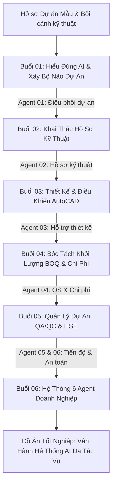

# KHÓA ĐÀO TẠO THỰC CHIẾN: AI AGENT TRONG KỸ THUẬT & XÂY DỰNG
### Nền tảng điều phối Trí tuệ nhân tạo chuyên sâu dành cho Kỹ sư, Kiến trúc sư & Quản lý dự án
**Đơn vị phát triển chương trình:** CES Global ([https://aec.cesglobal.com.vn/](https://aec.cesglobal.com.vn/))

---

## 1. TỔNG QUAN CHƯƠNG TRÌNH

Trong bối cảnh ngành xây dựng và kỹ thuật đang đối mặt với khối lượng hồ sơ đồ sộ, rủi ro sai sót thông tin và áp lực tối ưu hóa chi phí, khóa học **"Ứng Dụng AI Agent Trong Kỹ Thuật & Xây Dựng"** mang đến một phương pháp tiếp cận hoàn toàn mới: **Chuyển dịch từ việc "chat thử nghiệm câu lệnh rời rạc" sang "thiết lập hệ thống AI Workspace và mạng lưới AI Agent chuyên môn"**.

Chương trình được thiết kế đặc thù cho ngành kỹ thuật - xây dựng, **không yêu cầu kỹ năng lập trình**, tập trung vào việc biến các mô hình ngôn ngữ lớn (LLMs) như ChatGPT, Claude, Google Gemini và các công cụ chuyên ngành (AutoCAD, Revit, Excel) thành các trợ lý đắc lực tuân thủ nghiêm ngặt nguyên tắc **Human-in-the-loop (AI hỗ trợ - Con người kiểm soát và phê duyệt)**.

### Thông số cốt lõi của khóa học:
- **Thời lượng:** 6 buổi đào tạo trực tiếp (150 phút/buổi, tổng cộng 15 giờ làm việc thực chiến).
- **Cơ cấu đào tạo:** 30% Cơ sở lý luận & Phương pháp luận quản trị — 70% Thực hành tác nghiệp trên dự án mẫu.
- **Sản phẩm nghiệm thu toàn khóa:** 01 AI Workspace dự án hoàn chỉnh + 06 AI Agent chuyên môn hoạt động đồng bộ.

---

## 2. BẢN ĐỒ CẤU TRÚC 6 BUỔI ĐÀO TẠO & ĐẦU RA (DELIVERABLES)

| Buổi | Tên Chuyên Đề | Trọng Tâm Nghiệp Vụ | Agent Chuyên Môn | Sản Phẩm Nghiệm Thu |
| :---: | :--- | :--- | :--- | :--- |
| **01** | **Hiểu đúng AI — Xây bộ não cho dự án** | Phân biệt Chatbot vs Workspace vs Agent; Khung bảo mật Zero-training; Context Profile dự án | **Agent 01: Điều phối dự án** | System Prompt Trợ lý dự án, Thư viện câu lệnh kiểm tra, Bộ lọc Zero-hallucination |
| **02** | **Khai thác hàng trăm trang hồ sơ kỹ thuật** | Xử lý OCR, PDF, scan; So sánh phiên bản phát hành; Trích xuất Scope of Work & Lập RFI | **Agent 02: Hồ sơ kỹ thuật** | Agent rà soát hồ sơ, Ma trận yêu cầu kỹ thuật (Requirements Matrix), Phiếu RFI chuẩn hóa |
| **03** | **Từ yêu cầu công năng đến ý tưởng thiết kế** | Lập Design Brief; Phân khu mặt bằng; **Điều khiển AutoCAD bằng AutoLISP/Script**; Prompt phối cảnh | **Agent 03: Hỗ trợ thiết kế** | Design Brief dự án, 02 Phương án mặt bằng, Script sinh lệnh AutoCAD, Checklist kiểm tra bản vẽ |
| **04** | **AI cho BOQ, dự toán và kiểm soát chi phí** | Chuẩn hóa danh mục BOQ; Bóc tách khối lượng từ hồ sơ; So sánh báo giá; Cảnh báo vượt ngân sách | **Agent 04: QS & Quản trị chi phí** | Bảng tính BOQ chuẩn hóa, Bảng so sánh chào thầu đa nhà thầu, Bảng kiểm soát biến động chi phí |
| **05** | **Trợ lý AI quản lý dự án, QA/QC & HSE** | Tiến độ thi công WBS/Lookahead; Tự động hóa nhật ký công trường & biên bản họp; Risk Register & HSE | **Agent 05: Tiến độ - Báo cáo** **Agent 06: QA/QC & HSE** | Báo cáo tiến độ tuần, Nhật ký công trình tự động hóa, Checklist nghiệm thu QA/QC, Bảng quản trị rủi ro |
| **06** | **Xây đội ngũ AI Agent cho doanh nghiệp** | Thiết lập luồng trao đổi liên Agent (Multi-agent handoff); Quy trình bảo mật & SOP doanh nghiệp | **Hệ thống AI Workspace Hoàn Chỉnh** | Đồ án tốt nghiệp: Toàn bộ hệ sinh thái 6 Agent vận hành trên dự án thực tế, Promptbook doanh nghiệp |

---

## 3. NGUYÊN TẮC CỐT LÕI: HUMAN-IN-THE-LOOP (HITL)

Trong toàn bộ tài liệu và các bài thực hành, học viên được quán triệt nguyên tắc quản trị rủi ro tối cao:
1. **AI không thay thế kỹ sư:** AI đảm nhiệm vai trò trợ lý tổng hợp thông tin, soạn thảo văn bản sơ bộ, phát hiện điểm bất thường và đề xuất phương án.
2. **Kỹ sư chịu trách nhiệm pháp lý:** Toàn bộ số liệu khối lượng, giải pháp kết cấu, phê duyệt thiết kế và quyết định an toàn bắt buộc phải do Kỹ sư/Chủ nhiệm đồ án/Chỉ huy trưởng thẩm định và ký duyệt.
3. **Quy tắc "Không đủ dữ liệu phải hỏi lại":** Cấu hình chặt chẽ để AI không bao giờ tự tiện suy diễn hoặc giả định kích thước/thông số khi hồ sơ thiết kế bị thiếu hoặc mờ.

---

## 4. CẤU TRÚC THƯ MỤC TÀI LIỆU TRONG HỆ THỐNG

Tài liệu được phân loại theo cấu trúc thư mục tuần tự, khoa học:
- [00_Tong_Quan_Chuong_Trinh/](file:///f:/GitHub/Tai-lieu-khoa-hoc-ai-xay-dung/00_Tong_Quan_Chuong_Trinh/): Đề cương chi tiết 150 phút mỗi buổi, khung năng lực và sơ đồ kiến trúc hệ sinh thái 6 AI Agent.
- [01_Buoi_01_Hieu_Dung_AI_Xay_Dung_Bo_Nao_Du_An/](file:///f:/GitHub/Tai-lieu-khoa-hoc-ai-xay-dung/01_Buoi_01_Hieu_Dung_AI_Xay_Dung_Bo_Nao_Du_An/): Giáo án đứng lớp chi tiết (`giao-an-buoi-01.md`), Giáo trình chi tiết, Thư viện Prompt, Hướng dẫn bài Lab 01 và Rubric D1.
- [02_Buoi_02_Khai_Thac_Ho_So_Ky_Thuat/](file:///f:/GitHub/Tai-lieu-khoa-hoc-ai-xay-dung/02_Buoi_02_Khai_Thac_Ho_So_Ky_Thuat/): Phương pháp đọc hồ sơ thầu, trích xuất spec, lập RFI và bài Lab 02.
- [03_Buoi_03_Thiet_Ke_Va_Dieu_Khien_AutoCAD/](file:///f:/GitHub/Tai-lieu-khoa-hoc-ai-xay-dung/03_Buoi_03_Thiet_Ke_Va_Dieu_Khien_AutoCAD/): Lập Design Brief, điều khiển AutoCAD bằng AutoLISP/Script và bài Lab 03.
- [04_Buoi_04_Boc_Tach_Khoi_Luong_BOQ_Du_Toan/](file:///f:/GitHub/Tai-lieu-khoa-hoc-ai-xay-dung/04_Buoi_04_Boc_Tach_Khoi_Luong_BOQ_Du_Toan/): Kỹ thuật bóc tách khối lượng chống sai lệch, lập BOQ, so sánh đơn giá và bài Lab 04.
- [05_Buoi_05_Quan_Ly_Du_An_Tien_Do_QAQC_HSE/](file:///f:/GitHub/Tai-lieu-khoa-hoc-ai-xay-dung/05_Buoi_05_Quan_Ly_Du_An_Tien_Do_QAQC_HSE/): Quản trị tiến độ, tự động hóa nhật ký công trường, kiểm soát chất lượng & an toàn và bài Lab 05.
- [06_Buoi_06_He_Thong_6_Agent_Doanh_Nghiep/](file:///f:/GitHub/Tai-lieu-khoa-hoc-ai-xay-dung/06_Buoi_06_He_Thong_6_Agent_Doanh_Nghiep/): Tích hợp luồng phối hợp Multi-Agent, bảo mật doanh nghiệp và Đồ án tốt nghiệp D6.
- [templates/](file:///f:/GitHub/Tai-lieu-khoa-hoc-ai-xay-dung/templates/): Hệ thống biểu mẫu kỹ thuật chuẩn ngành xây dựng phục vụ nạp context cho AI.

---
*Bản quyền chương trình đào tạo thuộc về CES Global. Lưu hành nội bộ khóa học.*
